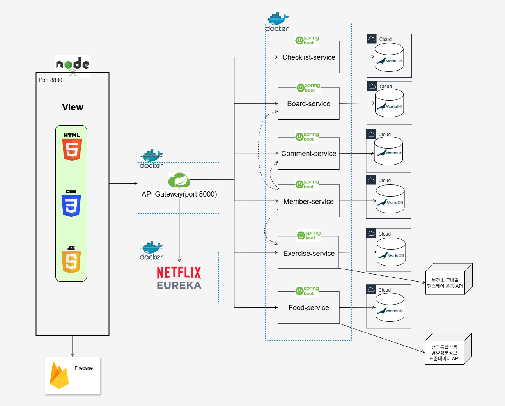

## 📌 프로젝트 개요

- 프로젝트 주제: MSA 리팩토링  
- 기간: 2025.06.30 ~ 2025.07.15 (16일)  
- 소개: 모놀리식 아키텍처로 구성된 기존 시스템을 MSA 구조로 리팩토링하여 서비스 분리, 인증 구조 개선, Docker 기반 배포 자동화 등 구조적 개선을 진행

 

## 👥 팀 구성 및 역할

| 이름     | 담당 서비스                        | 추가 기술                                      |
|----------|------------------------------------|-------------------------------------------|
| 염윤호    | exercise-service                  | RestTemplate 기반 서비스 간 통신 구현      |
| 고민표    | member-service                    | JWT 기반 인증/인가 구조 리팩토링               |
| 박희수    | food-service                      | RestTemplate 기반 서비스 간 통신 구현       |
| 이재원    | board-service, comment-service    | SPA 구조 적용                              |
| 이창훈    | checklist-service                 | Docker 이미지 빌드 및 Compose 구성         |

 

## 🏗️ 소프트웨어 아키텍처

 

## 🔧 주요 변경사항

- 각 마이크로서비스를 Netflix Eureka를 통해 통합 관리하고, API Gateway를 통해 단일 포트 접근 방식으로 구성  
- 인증(Authentication)은 member-service에서 담당하고, 인가(Authorization)는 API Gateway에서 처리  
- Docker 이미지화 및 docker-compose를 통한 멀티 컨테이너 실행 환경 구축

 

## 💻 추가 개발환경

### 🧩 운영 관리  
  

### ⚙️ DevOps  
  
